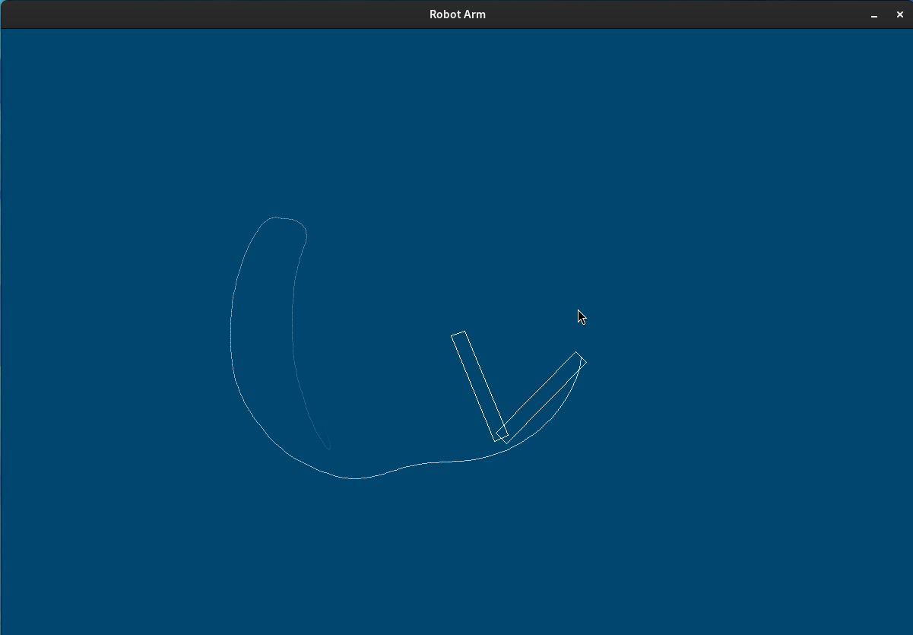

# Double Pendulum Robot Arm Controller

<!--  -->

## The Functionality

The Robot is a double pendulum equipped with two motors, one at the base and one at the joint of the links. When the controller is deactivated, it will swing freely under the physics applied with regard to the weight and size defined. The joints are 50 cm long and weight 1 kg each. The joints are damped to simulate a resistance from the motors and gears.

The endeffector follows the mouse pointer under a defined control law.

Two keys can be pressed to influence the behavior of the program:

- T: Activate/deactivate the trace the endeffector draws on the screen.
- C: Activate/deactivat the controller.

## Equations of motion

- will follow
- test

## Control law (non-linear control)

- will follow
